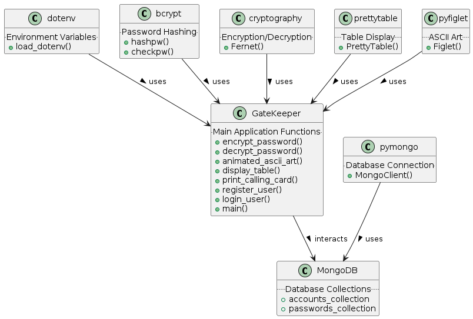

# GateKeeper CLI Application

## Description
GateKeeper is a command-line interface (CLI) application for managing user accounts and passwords securely. It provides functionalities for user registration, login, and account management with encrypted password storage.

## Features
- **User Registration**: Securely register new users.
- **User Login**: Authenticate users with bcrypt password hashing.
- **Account Management**: Add, view, and delete accounts with encrypted password storage using Fernet cryptography.
- **Visually Appealing CLI**: Includes ASCII art and table formatted output for a better user experience.

## MongoDB Integration
GateKeeper uses MongoDB, a NoSQL database, for storing user data and account information. Ensure you have MongoDB installed and running on your server or local machine. You can find more information and installation instructions for MongoDB at GateKeeper uses MongoDB, a NoSQL database, for storing user data and account information. Ensure you have MongoDB installed and running on your server or local machine. You can find more information and installation instructions for MongoDB [here](https://docs.mongodb.com/manual/installation/). 

## Installation
To install the necessary dependencies for GateKeeper, run the following command:
```bash
pip install -r requirements.txt
```
## Environment Configuration
Create a .env file in the root directory of the application to store environment    variables. This file should contain:

- MONGO_URL: The connection URL for your MongoDB instance.
- ACCOUNTS_COLLECTION: The name of the MongoDB collection for user accounts.
- PASSWORDS_COLLECTION: The name of the MongoDB collection for passwords.

### Example .env file:
```bash
MONGO_URL=mongodb://localhost:27017/
ACCOUNTS_COLLECTION=accounts
PASSWORDS_COLLECTION=passwords
```

## Usage
To run the GateKeeper application, execute the following command:
```bash
python gatekeeper.py
```

## UML Diagram
The UML diagram below illustrates the class structure and relationships in the GateKeeper application.


